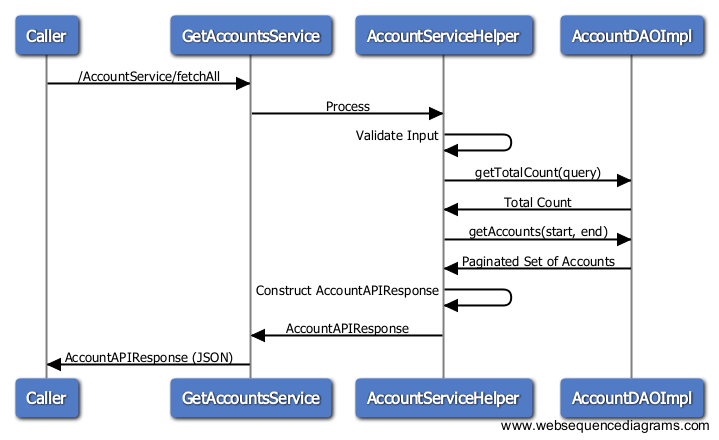

# About
This is a sfdc case study of integrating accounts from old instance (legacy) into the new instance (new) via APEX Rest API. This application will allow the business users to 
- View all the accounts in the legacy instance.
- Create new account in the new instance and match it with a legacy account with the same name.

# Assumptions
The following assumptions were made when creating this application.
- Since there is a 1-to-1 between the New and Legacy Accounts, if multiple accounts are returned from the legacy API, the first one is matched.
- The "account matching" function is only pertinent for this use case and hence we cannot use a Trigger to update the account.

# Application Structure
The application is broken down into two sub-projects/application:
  - **newinstance**: Contains the VF pages, Apex Controllers to be run on the new instance. This will host the page which the business user will access to create new account and to display all legacy accounts.
  - **oldinstance**: Contains the REST API Service which will fetch the data for legacy accounts. The API will be accessed from the VF page on newinstance

Below are the different components of the applications:
### newinstance
##### application
  - **[LegacyAccountsView.page]**: UI for Creating new account and fetching accounts from the legacy instance
  - **[LegacyAccountsController.cls]**: Controller for the VisualForce page
  - **[LegacyAccountsHelper.cls]**: Helper class which will make REST API calls to the legacy instance to fetch/query accounts.
  - **[PaginatedDataTable.component]**: Reusable Component to render the fetched accounts in a paginated data table.
  - **[AccountsPaginationController.cls]**: Controller for fetching legacy accounts to render in a paginated data table
  - **[PaginationController.cls]**: Base Controller that handles pagination and navigation. This will be extended by AccountsPaginationController
  - **[AccountAPIResponse.cls]**: Wrapper class to hold the JSON API Response.
  - **[AppException.cls]**: Application Exception containing utility functions to write to a custom error object
  
##### test
  - **[AccountsTest.cls]**: Unit test class containing methods to test different use cases
  - **[MockGetHttpCallout.cls]**: Class used to Mock Http callouts during test execution
 
### oldinstance
##### application
  - **[GetAccountsService.cls]**: REST API Endpoint to handle the request to get all accounts from the DB in a paginated set
  - **[QueryAccountsService.cls]**: REST API Endpoint to handle the request to query Accounts based on name from the DB in a paginated set
  - **[AccountServiceHelper.cls]**: Helper class which will fetch or query the records from the DB using a DAO
  - **[AccountDAO.cls]**: DAO Interface containing two functions getTotalCount() and getAccounts()
  - **[AccountDAOImpl.cls]**: Basic DAO Implementation using LIMIT and OFFSET to support pagination.
  - **[StdSetAccDAOImpl.cls]**: (Not used) DAO Implementation to demonstrate the use of StandardSetController to fetch paginated data set
  - **[AccountAPIRequest.cls]**: Wrapper class to hold the incoming parameters in a API.
  - **[AccountAPIResponse.cls]**: Wrapper class to hold the JSON API Response.
  - **[APIResponse.cls]**: Base API Response containing status and errorMessage. Child API responses should add their own fields. E.g. AccountAPIResponse
  - **[APIException.cls]**: Custom Exception class
  
##### test
  - **[APITest.cls]**: Unit test class containing methods to test different use cases

# Design Considerations
### Pagination options considered
- The default implementation of AccountDAO uses LIMIT and OFFSET to return a subset of the data. The problem with this approach is that SOQL does not support OFFSETing more than 2000 records.
- The next alternative would be to use StandardSetController with a DB QueryLocator. But even the StandardSetController can only hold about 10,000 records.
- This limit can be mitigated by invoking the Standard REST Query API. This API returns a "nextPageUrl" parameter that points to the next page. The client can then query this URL to get the next page data. The downside is that there is no "previousPageUrl", so the client will have to maintain state on their end.

### Security
- The new instance had to store the username, password, client id and secret that needs to be passed when invoking the REST API on the legacy instance. 
- The CustomSettings option was considered. This would involve:
    * Creating a "protected" CustomSettings with restrictive permissions
    * Querying the CustomSettings in APEX and invoking the Auth REST API
    * Passing the auth token to every other REST API call.
- A better alternative was to use NamedCredential in the new instance. 
    -  Using NamedCredential (and an AuthorizationProvider), we can do a one-time setup so that the API user of new instance can talk to api user of legacy instance using OAuth. 
    -  This one-time set up configures the system-to-system authorizatoin and can be used in the Apex callouts
    -  No need to call Auth REST API before calling other REST APIs
    -  The Http endpoint will be of the format 'callout:NamedCredentialName/REST of the URL'
- Also, to protect against SOQL Injection, we execute a DML statement using parameters (using :) instead of String concatenation in Database.query().

### Triggers
- Based on Assumption 2, the Trigger option was ruled out. If a "after insert" trigger was used on the Account, it will always query and match the legacy account irrespective of where the account was created from.

# UML Diagram
### Class Diagram

### Sequence Diagram

#### Flow in New Instance

#### Get API Flow

#### Query API Flow

[LegacyAccountsView.page]: <newInstance/src/pages/LegacyAccountsView.page>
[LegacyAccountsController.cls]: <newInstance/src/classes/LegacyAccountsController.cls>
[LegacyAccountsHelper.cls]: <newInstance/src/classes/LegacyAccountsHelper.cls>
[PaginatedDataTable.component]: <newInstance/src/components/PaginatedDataTable.component>
[AccountsPaginationController.cls]: <newInstance/src/classes/AccountsPaginationController.cls>
[PaginationController.cls]: <newInstance/src/classes/PaginationController.cls>
[AccountAPIResponse.cls]: <newInstance/src/classes/AccountAPIResponse.cls>
[AppException.cls]: <newInstance/src/classes/AppException.cls>
[AccountsTest.cls]: <newInstance/src/classes/AccountsTest.cls>
[MockGetHttpCallout.cls]: <newInstance/src/classes/MockGetHttpCallout.cls>
[GetAccountsService.cls]: <oldInstance/src/classes/GetAccountsService.cls>
[QueryAccountsService.cls]: <oldInstance/src/classes/QueryAccountsService.cls>
[AccountServiceHelper.cls]: <oldInstance/src/classes/AccountServiceHelper.cls>
[AccountDAO.cls]: <oldInstance/src/classes/AccountDAO.cls>
[AccountDAOImpl.cls]: <oldInstance/src/classes/AccountDAOImpl.cls>
[StdSetAccDAOImpl.cls]: <oldInstance/src/classes/StdSetAccDAOImpl.cls>
[AccountAPIRequest.cls]: <oldInstance/src/classes/AccountAPIRequest.cls>
[AccountAPIResponse2.cls]: <oldInstance/src/classes/AccountAPIResponse.cls>
[APIResponse.cls]: <oldInstance/src/classes/APIResponse.cls>
[APIException.cls]: <oldInstance/src/classes/APIException.cls>
[APITest.cls]: <oldInstance/src/classes/APITest.cls>